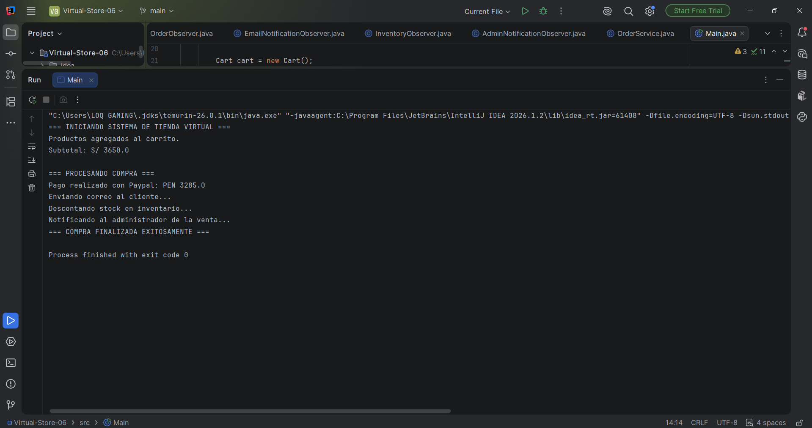

#Patrones de Diseño PC1

# Tienda Virtual - Implementación de Patrones de Diseño

## Descripción del problema abordado
El objetivo de este proyecto es desarrollar el motor de una tienda virtual desde consola. El sistema resuelve tres problemas:
1. Calcular totales con métodos de descuento variables (Strategy).
2. Procesar pagos integrando APIs externas incompatibles (Adapter).
3. Desacoplar el flujo de notificaciones para alertas automáticas (Observer).

# Evidencia de Ejecución
A continuación se muestra la consola ejecutando el flujo completo de la compra, calculando el subtotal, aplicando el descuento, procesando el pago y emitiendo las tres notificaciones:
